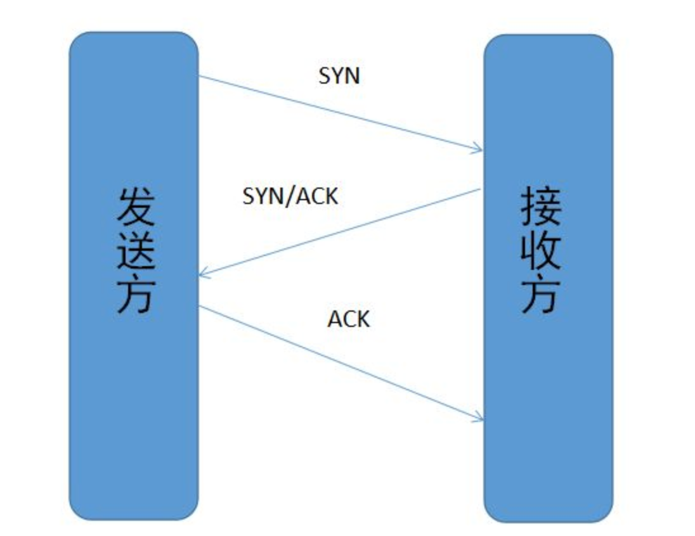
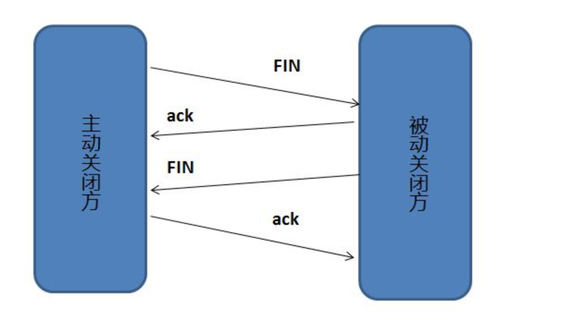

# 计算机网络常见知识点

## 1. OSI 与 TCP/IP 各层的结构与功能，都有哪些协议

我们一般采用比较折中的办法，就是中和 OSI 和 TCP/IP 的优点，采用一种只有五层协议的体系结构

我们自上而下的介绍一下各层的作用

### 1.1 应用层

应用层（application-layer）的任务是通过应用**进程间的交互**来完成特定的网络应用

主要协议包括

- 域名系统DNS
- HTTP协议
- 电子邮件的SMTP协议

### 1.2 运输层

运输层（transport layer）的主要任务就是负责**向两台主机进程**之间的通信提供通用的数据传输服务

传输层的主要协议：

- **传输控制协议TCP**（Transmission Control Protocol）

  提供**面向连接**的，**可靠的**数据传输服务。

- **用户数据协议 UDP**（User Datagram Protocol）

  提供**无连接**的，尽最大努力的数据传输服务（**不保证数据传输的可靠性**）。

### 1.3 网络层

在计算机网络中进行通信的两个计算机之间**可能会经过很多个数据链路**，也可能还要经过很多通信子网，网络层的任务就是**选择合适的网间路由和交换结点，确保数据及时传送**。

在发送数据时，网络层把运输层产生的报文段或用户数据报封装成分组和包进行传送。在 TCP/IP 体系结构中，由于网络层使用 **IP 协议**，因此分组也叫 **IP 数据报** ，简称 **数据报**。

### 1.4 数据链路层

**数据链路层(data link layer)通常简称为链路层。两台主机之间的数据传输，总是在一段一段的链路上传送的，这就需要使用专门的链路层的协议。** 在两个相邻节点之间传送数据时，**数据链路层将网络层交下来的 IP 数据报组装成帧**，在两个相邻节点间的链路上传送帧。每一帧包括数据和必要的控制信息（如同步信息，地址信息，差错控制等）。

### 1.5 物理层

在物理层上所传送的数据单位是比特。 **物理层(physical layer)的作用是实现相邻计算机节点之间比特流的透明传送，尽可能屏蔽掉具体传输介质和物理设备的差异。**

## 2. TCP 三次握手和四次挥手（常问）

为了准确无误的把数据送达目标处，TCP协议采用了三次握手策略

### 2.1 TCP 三次握手漫画图解

如下图所示，下面的两个机器人通过3次握手确定了对方能正确接收和发送消息

简单示意图：

- 客户端：发送带有SYN 标志的数据包  一次握手-服务端
- 服务端- 发送带有SYN/ACK 标志的数据包— 二次握手— 客户端
- 客户端— 发送带有ACK 标志的数据包  三次握手 服务端

### 2.2 为什么要三次握手

三次握手的目的是建立可靠的通信信道，说到通讯，简单来说就是数据发送与接收，而三次握手最主要的目的就是**双方确认与对方的发送和接收是正常的**

- 第一次握手：Client 什么都不能确认；Server 确认了对方发送正常，自己接收正常

- 第二次握手：Client 确认了：自己发送、接收正常，对方发送、接收正常；Server 确认了：对方发送正常，自己接收正常

- 第三次握手：Client 确认了：自己发送、接收正常，对方发送、接收正常；Server 确认了：自己发送、接收正常，对方发送、接收正常

所以三次握手就能确认双发收发功能都正常，缺一不可。

### 2.3 为什么要传回SYN

接收端传回发送端发送的SYN 是为了告诉发送端，**我接收到的信息确实就是你所发送的信号**了

### 2.4 传了SYN, 为啥还要传ACK

双方通信无误必须是**两者互相发送和接收**消息都无误

- 传了SYN，证明发送方到接收方的通道没问题
- 但是接收方到发送方的通道还需要ACK 信号来进行校验

## 3. TCP 四次挥手（常问）

断开一个TCP 连接则需要”四次挥手“

- 客户端-发送一个FIN，用来关闭客户端到服务器的数据传送
- 服务器-收到这个FIN，它发回一个ACK，确认序号为收到的序号加1。和SYN 一样，一个FIN 将占用一个序号
- 服务器-**关闭与客户端连接**，发送送一个FIN 给客户端
- 客户端- 发送ACK 报文确认，并将确认序号设置为收到序号加1

### 3.1 为什么要四次挥手

**任何一方都可以在数据传送结束后发出发出释放通知**，待对方确认后**进入办关闭状态**，当另一方也没有数据在发送的时候，则发送链接释放通知。**对方确认后就完全关闭了TCP 链接**

>举个例子：A 和 B 打电话，通话即将结束后，A 说“我没啥要说的了”，B回答“我知道了”，但是 B 可能还会有要说的话，A 不能要求 B 跟着自己的节奏结束通话，于是 B 可能又巴拉巴拉说了一通，最后 B 说“我说完了”，A 回答“知道了”，这样通话才算结束。

## 4. TCP,UDP 协议的区别

- **UDP 在传送数据之前不需要建立连接，远地主机在收到UDP 报文后，不需要给出任何确认**
  - QQ语言
  - QQ视频
  - 直播等
- **TCP提供面向连接的服务。在传送数据之前必须建立连接，数据传送结束后释放连接**。
  -  文件传输
  - 发送和接收邮件
  - 远程登录

## 5. TCP 协议如何保证可靠传输

